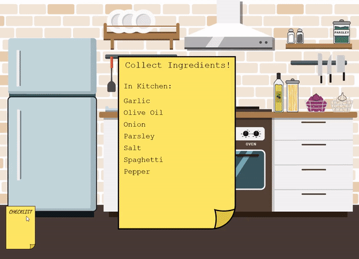

# Cooking Pasta Game

### Introduction
This is a single-player game which involves keyboard and mouse input. It takes the player through the process of creating a pasta dish where the player is required to perform a series of tasks within each stage. A Graphical User Interface (GUI) and sound effects were implemented to allow an immersive experience and realistic visualization of a cooking environment.
* This game was developed using Scala, and the GUI library used was ScalaFX.
* All illustrations were designed using Adobe Illustrator.
* All audio clips used are no-copyright and royalty-free, unless stated.  

<p align="center">
  
</p>

### Prerequisites
ScalaFX was used in this project which requires JDK 8. This project was built using sbt.

```
The following are instructions on how to deploy the game on your system.
1. Install the src folder and built.sbt file.
2. Open cmd and go to the project folder.
3. Type 'sbt' and run.
```

### Additional Resources
#### Gameplay
Gameplay of Cooking Pasta Game. https://youtu.be/MdASDhYxPsQ
#### Background music
Firefly by less.people (Provided by Lofi Records). https://youtu.be/VfdbF5x_BPg
